# GreenSkills 2025 Defense CTF

## [0x00] About GreenSkills 2025 Defense CTF

**GreenSkills 2025** - мероприятие, проводимое внутри АО "Гринатом" с целью отбора команд компетенции "F8 Информационная безопасность" для участия в **X Отраслевом чемпионате Госкорпорации Росатом Atom Skills 2025**. 

Перечень сервисов:
1. atom-power-station - Python
2. atom-shop - PHP
3. atom-study - Golang

---
## [0x01] Scores and Status codes

Sploits:
- 101 OK: The host is vulnerable
- 102 NO: The host is not vulnerable 
- 110 SPLOIT ERROR: Internal error in sploit

Checkers:
- 101 OK: The service works correctly
- 104 DOWN: The service doesn't work
- 110 CHECKER ERROR: Internal error in checker

---
## [0x02] Service 1: atom-power-station

Тренировочная платформа атомной станции ГК «Росатом» — это инновационный образовательный центр, где готовят специалистов для безопасной и эффективной работы на энергетических объектах. Платформа оснащена передовыми тренажёрами и симуляторами, которые имитируют работу передовых реакторов, соответствующих самым высоким стандартам безопасности и экологичности.Здесь обучаются высококвалифицированные специалисты, прошедшие строгий отбор и получившие необходимые знания и навыки. Они учатся управлять реакторами, обеспечивая безопасность и эффективность работы станции. «Росатом» активно участвует в социальных проектах и программах по развитию региона М***, предоставляя рабочие места, обучая местное население и поддерживая экологические инициативы.Платформа постоянно совершенствуется и внедряет новые технологии, чтобы стать ещё более безопасной и эффективной.

### Vuln 1: SSTI in a Cert file creation

На сервисе **atom-power-station** доступно удаленное выполнение кода через эксплуатацию SSTI. Для ее эксплуатации необходимо перейти в тренировку под номером **5**, т.к. после нее можно создать сертификат о прохождении обучения. Cоздать сертификат нужно с использованием полезной нагрузки для эксплуатации SSTI:

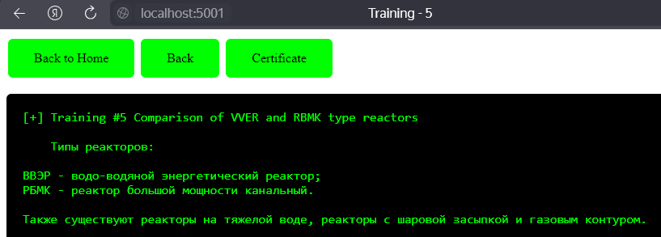

```
{{ self.__init__.__globals__.__builtins__.__import__('os').popen('id').read() }}
```

Нагрузку необходимо применять относительно поля **filename**:

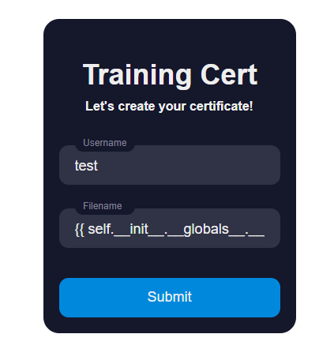

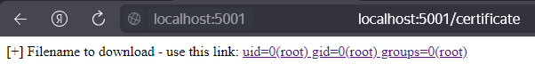

### Patch for Vuln 1

Найдем уязвимый блок кода (**main.py**):

```python
# Router: Create Certificate File
@app.route("/certificate", methods=["GET", "POST"])
@login_required
def certificate():
    if request.method == "POST":
        username = request.form.get("username")
        filename = request.form.get("filename")
        
        filepath = os.path.join("/app/storage", filename)
        
        os.system(f'echo "Certificate for {username} | File was created in AtomPowerStation system - {filename}" > {filepath}')

        return render_template_string('[+] Filename to download - use this link: <a href="/files">%s</a>' % (filename))
    else:
        return render_template("certificate.html")
```

Проблема заключается в обработке шаблона (строки), который мы видим, когда нам предлагают скачать файл, при помощи **render_template_string()**. Параметр не нужно передавать через **%s**. Вместо этого, можно сделать следующим образом:

```python
# Router: Create Certificate File
@app.route("/certificate", methods=["GET", "POST"])
@login_required
def certificate():
    if request.method == "POST":
        username = request.form.get("username")
        filename = request.form.get("filename")
        
        filepath = os.path.join("/app/storage", filename)
        
        os.system(f'echo "Certificate for {username} | File was created in AtomPowerStation system - {filename}" > {filepath}')

        return render_template_string('[+] Filename to download - use this link: <a href="/files">{{ filename }}</a>', filename=filename)
    else:
        return render_template("certificate.html")
```

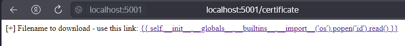

Как видим, SSTI больше не работает, т.к. мы использовали безопасную вставку имени файла.

---

### Vuln 2: (Blind) RCE

Почему **Blind** указано в скобках? На самом деле, удаленное выполнение кода действительно работает, но результат на HTML-странице мы увидеть не можем, зато можем сохранить результат выполнения команды в отдельный файл и поместить в директорию, откуда мы можем читать файлы, а это у нас **/app/storage**. Все также вставляем полезную нагрузку в параметр **filename**:

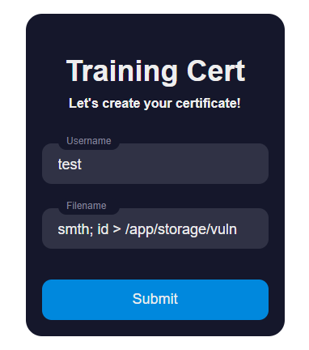

Пробуем создать сертификат и вместе с ним выполнить команду с сохранением в другой файл. В итоге создается 2 файла:

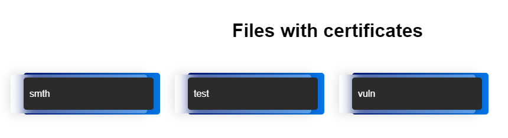

Содержимое сертификата:

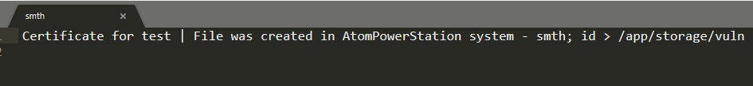

А это уже второй файл с выводом команды **id**:

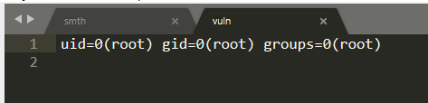

### Patch for Vuln 2

Для того, чтобы исправить уязвимость, необходимо сменить способ записи данных в файл. Виесто **os.system(echo)**:

```python
# Router: Create Certificate File
@app.route("/certificate", methods=["GET", "POST"])
@login_required
def certificate():
    if request.method == "POST":
        username = request.form.get("username")
        filename = request.form.get("filename")
        
        filepath = os.path.join("/app/storage", filename)
        
        os.system(f'echo "Certificate for {username} | File was created in AtomPowerStation system - {filename}" > {filepath}')

        return render_template_string('[+] Filename to download - use this link: <a href="/files">{{ filename }}</a>', filename=filename)
    else:
        return render_template("certificate.html")
```

Используем запись в файл при помощи **with open()**:

```python
# Router: Create Certificate File
@app.route("/certificate", methods=["GET", "POST"])
@login_required
def certificate():
    if request.method == "POST":
        username = request.form.get("username")
        filename = request.form.get("filename")
        
        filepath = os.path.join("/app/storage", filename)
        
        with open(filepath, 'w') as file:
            file.write(f"Certificate for {username} | File was created in AtomPowerStation system - {filename}")

        return render_template_string('[+] Filename to download - use this link: <a href="/files">{{ filename }}</a>', filename=filename)
    else:
        return render_template("certificate.html")
```

---

### Vuln 3: Path Traversal (/etc/passwd leak)

Заключительной уязвимостью на сервисе **atom-power-station** является Path Traversal, с помощью которой мы можем читать системные файлы. Уязвимость возникает при загрузке файлов из **/files**, где присутствуют все файлы, которые скачиваются через **/download?filename=**:

```
http://localhost:5001/download?filename=../../etc/passwd
```

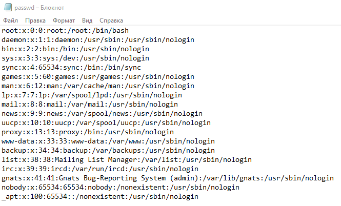

### Patch for Vuln 3

Чтобы исправить уязвимость, необходимо ограничить директорию, из которой доступно скачивание файлов. Уязвимый код:

```python
# Router: Download Certificate File
@app.route('/download')
@login_required
def download_file():
    filename = request.args.get('filename')
    if not filename:
        return "[-] Filename not provided", 400
    
    filepath = os.path.join('/app/storage', filename)

    try:
        return send_file(filepath, as_attachment=True)
    except FileNotFoundError:
        return "[-] File not found", 404
```

Исправленный код:

```python
# Router: Download Certificate File
@app.route('/download')
@login_required
def download_file():
    filename = request.args.get('filename')
    if not filename:
        return "[-] Filename not provided", 400
    
    # Базовая директория, в которой хранятся файлы
    storage_dir = os.path.abspath('/app/storage')

    # Полный путь к файлу
    filepath = os.path.abspath(os.path.join(storage_dir, filename))

    # Проверка, что файл находится в пределах директории storage_dir
    if not filepath.startswith(storage_dir):
        return "[-] Invalid file path", 200

    try:
        return send_file(filepath, as_attachment=True)
    except FileNotFoundError:
        return "[-] File not found", 404

```

Вот и первый полностью исправленный сервис!

---
## [0x03] Service 2: atom-shop

Корпоративный магазин ГК «Росатом» предлагает уникальный ассортимент эксклюзивного мерча, созданного специально для сотрудников и партнёров компании. Здесь можно найти стильные и качественные товары с символикой «Росатома», которые станут отличным подарком или дополнением к образу. В магазине представлен широкий выбор одежды, аксессуаров и сувениров: футболки, худи, кепки, сумки, браслеты, зажигалки и многое другое. Все изделия выполнены из высококачественных материалов и отличаются оригинальным дизайном.Особое внимание уделяется комфорту и практичности: одежда и аксессуары изготовлены из мягких и приятных к телу тканей, не вызывающих аллергии и раздражения кожи. Кроме того, они легко стираются и долго сохраняют свой первоначальный вид. В магазине регулярно проводятся акции и распродажи, что позволяет приобрести товары по выгодным ценам. Также действует система скидок для постоянных покупателей и сотрудников «Росатома». Корпоративный магазин ГК «Росатом» — это идеальное место для тех, кто хочет поддержать имидж компании и выразить свою преданность её ценностям. Здесь каждый найдёт что-то для себя, будь то стильный аксессуар или подарок для близкого человека.

### Vuln 1: Hidden Admin Parameter

На сервисе **atom-shop** существует возможность регистрации от лица администратора. В коде сервиса (**register.php**) есть параметр **is_admin**, который по умолчанию принимает значение **False**, если параметр не передан при регистрации, но если при регистрации указать этот параметр со значением **True**, то пользователь станет администратором. Уязвимый блок кода представлен ниже:

```php
<?php
    require_once 'conn.php';
    if (isset($_POST['register'])){
        $name = $_POST['name'];
        $username = $_POST['username'];
        $password = $_POST['password'];
        $is_admin = $_POST['is_admin'] ?? 'False';  // Hidden
        $roscoins = 5000;
        $greencoins = 2000;
 
        $query = "INSERT INTO `user` (name, username, password, is_admin, roscoins, greencoins) 
            VALUES ('$name', '$username', '$password', '$is_admin', '$roscoins', '$greencoins')";
 
        $conn -> exec($query);
        echo "<center><h4 class='text-success' style='color: lime;'>Successfully registered!</h4></center>";
    }
?>
```

Собственно, указать этот параметр нельзя через обычную форму регистрации, в таком случае требуются какие-либо средства автоматизации (см. **atom-shop sploits**).

### Patch for Vuln 1

По сути, патч для рассмотренной выше уязвимости крайне прост - нужно просто удалить этот параметр при регистрации, но лучше установить данный параметр в значение **False**:

```php
<?php
    require_once 'conn.php';
    if (isset($_POST['register'])){
        $name = $_POST['name'];
        $username = $_POST['username'];
        $password = $_POST['password'];
        $is_admin = 'False';
        $roscoins = 5000;
        $greencoins = 2000;
 
        $query = "INSERT INTO `user` (name, username, password, is_admin, roscoins, greencoins) 
            VALUES ('$name', '$username', '$password', '$is_admin', '$roscoins', '$greencoins')";
 
        $conn -> exec($query);
        echo "<center><h4 class='text-success' style='color: lime;'>Successfully registered!</h4></center>";
    }
?>
```

При этом, такой патч не сломает логику сервиса в части профиля (см. **content_blocks/profile_content.php**):

```php
<h2>Name: <?php echo $_SESSION['username'] ?></h2>
<h4>Username ID: 
    <?php 
        if ($_SESSION['admin'] == "True") {
            echo "Administrator";
        } else {
            echo "Client";
        }
    ?>
</h4>
```

Если говорить более подробно, то все зарегистрированные пользователи будут иметь роль **Client** при регистрации. Как таковая роль **Administrator** нигде не используется, кроме как при отображении в HTML, что показывает код, представленный выше. Если же просто удалить строку с параметром, то появится предупреждение при регистрации.

---

### Vuln 2: Path Traversal

Вторая уязвимость на сервисе **atom-shop** - Path Traversal. 

```
http://localhost:43434/home.php?view=../../../../etc/passwd
```

Происходит это по причине подгрузки содержимого страницы через параметр **view** (файл **home.php**):

```php
<?php
    if (!isset($_GET['view']) || ($_GET['view'] == "home.php")) {
        require "content_blocks/home_content.php";
    } else {
        echo "<section>";
        include("/var/www/html/content_blocks/" .$_GET['view']);
        echo "</section>";
    }
?>
```

### Patch for Vuln 2

По факту, чтобы исправить уязвимость, можно ограничить показ страниц через параметр **view** только теми, которые предусмотрены функционалом сервиса, т.е., которые находятся в папке **content_blocks**:

```php
<?php
    // Определяем допустимые значения для параметра 'view'
    $allowed_views = ['about-us_content.php', 'exchange.php', 'profile_content.php', 'home_content.php'];

    // Если параметр 'view' не установлен или равен 'home.php', показываем домашнюю страницу
    if (!isset($_GET['view']) || $_GET['view'] == "home.php") {
        require "content_blocks/home_content.php";
    } else {
        $view = basename($_GET['view']);

        // Проверяем, что значение 'view' находится в списке допустимых
        if (in_array($view, $allowed_views)) {
            echo "<section>";
            include("/var/www/html/content_blocks/" . $view);
            echo "</section>";
        } else {
            // Если значение не допустимо, можно вывести ошибку или перенаправить на страницу по умолчанию
            echo "Invalid view selected.";
        }
    }
?>
```

Проверяем наш патч:

```
http://localhost:43434/home.php?view=../../../../etc/passwd
```

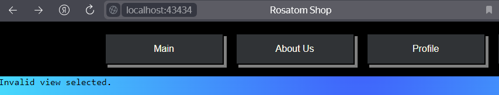

---

### Vuln 3: Cheating Money

Заключительная уязвимость на сервисе заключается в накрутке валют. Изначальный общий баланс на аккаунте составляет **7000** (**5000 Roscoins** и **2000 Greencoins**):

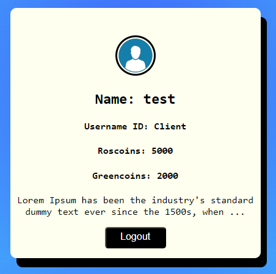

Если мы обменяем одну валюту на другую с применением отрицательного баланса, то общий баланс увеличится:

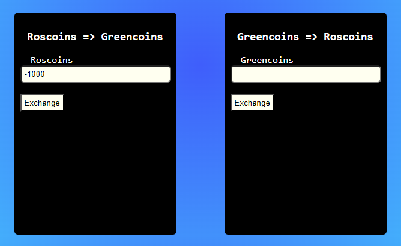

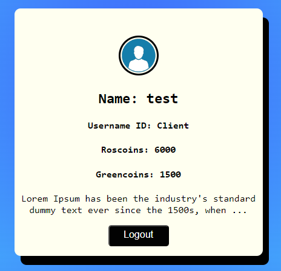

Как видим, наш общий баланс составляет **7500**!

### Patch for Vuln 3

Чтобы исправить уязвимость, достаточно внедрить проверку на ввод отрицательного значений (причем сделать это лучше в двух местах). Уязвимый код (exchange.php):

```php
<?php
require_once 'conn.php';

$roscoinToGreencoinMessage = '';
$greencoinToRoscoinMessage = '';

if ($_SERVER['REQUEST_METHOD'] == 'POST') {
    $username = $_SESSION['username'];
    $roscoins = isset($_POST['roscoins']) ? intval($_POST['roscoins']) : 0;
    $greencoins = isset($_POST['greencoins']) ? intval($_POST['greencoins']) : 0;

    // Выбор текущих значений roscoins и greencoins пользователя
    $query = $conn->prepare("SELECT roscoins, greencoins FROM `user` WHERE username = ?");
    $query->bindValue(1, $username, SQLITE3_TEXT);
    $result = $query->execute();
    $user = $result->fetchArray(SQLITE3_ASSOC);

    if ($user) {
        $currentRoscoins = $user['roscoins'];
        $currentGreencoins = $user['greencoins'];

        // Обмен Roscoins на Greencoins (курс 1 Roscoin = 0.5 Greencoin)
        if (isset($_POST['roscoins']) && !isset($_POST['greencoins'])) {
            $exchangeRate = 0.5;
            $newRoscoins = $currentRoscoins - $roscoins;
            $newGreencoins = $currentGreencoins + ($roscoins * $exchangeRate);

            if ($newRoscoins >= 0) {
                $updateQuery = $conn->prepare("UPDATE user SET roscoins = ?, greencoins = ? WHERE username = ?");
                $updateQuery->bindValue(1, $newRoscoins, SQLITE3_INTEGER);
                $updateQuery->bindValue(2, $newGreencoins, SQLITE3_INTEGER);
                $updateQuery->bindValue(3, $username, SQLITE3_TEXT);
                $updateQuery->execute();
                $roscoinToGreencoinMessage = "<center><div class='alert' style='color: lime;'>Exchange successful!</div></center>";
            } else {
                $roscoinToGreencoinMessage = "<center><div class='alert' style='color: red;'>Not enough Roscoins!</div></center>";
            }
        }

        // Обмен Greencoins на Roscoins (курс 1 Greencoin = 2 Roscoins)
        if (isset($_POST['greencoins']) && !isset($_POST['roscoins'])) {
            $exchangeRate = 2;
            $newGreencoins = $currentGreencoins - $greencoins;
            $newRoscoins = $currentRoscoins + ($greencoins * $exchangeRate);

            if ($newGreencoins >= 0) {
                $updateQuery = $conn->prepare("UPDATE user SET roscoins = ?, greencoins = ? WHERE username = ?");
                $updateQuery->bindValue(1, $newRoscoins, SQLITE3_INTEGER);
                $updateQuery->bindValue(2, $newGreencoins, SQLITE3_INTEGER);
                $updateQuery->bindValue(3, $username, SQLITE3_TEXT);
                $updateQuery->execute();
                $greencoinToRoscoinMessage = "<center><div class='alert' style='color: lime;'>Exchange successful!</div></center>";
            } else {
                $greencoinToRoscoinMessage = "<center><div class='alert' style='color: red;'>Not enough Greencoins!</div></center>";
            }
        }
    }
}
?>
```

Исправленный вариант:

```php
<?php
require_once 'conn.php';

$roscoinToGreencoinMessage = '';
$greencoinToRoscoinMessage = '';

if ($_SERVER['REQUEST_METHOD'] == 'POST') {
    $username = $_SESSION['username'];
    $roscoins = isset($_POST['roscoins']) ? intval($_POST['roscoins']) : 0;
    $greencoins = isset($_POST['greencoins']) ? intval($_POST['greencoins']) : 0;

    // Проверка на отрицательные значения
    if ($roscoins < 0 || $greencoins < 0) {
        $roscoinToGreencoinMessage = "<center><div class='alert' style='color: red;'>Invalid input: negative values are not allowed.</div></center>";
    } else {
        // Выбор текущих значений roscoins и greencoins пользователя
        $query = $conn->prepare("SELECT roscoins, greencoins FROM `user` WHERE username = ?");
        $query->bindValue(1, $username, SQLITE3_TEXT);
        $result = $query->execute();
        $user = $result->fetchArray(SQLITE3_ASSOC);

        if ($user) {
            $currentRoscoins = $user['roscoins'];
            $currentGreencoins = $user['greencoins'];

            // Обмен Roscoins на Greencoins (курс 1 Roscoin = 0.5 Greencoin)
            if (isset($_POST['roscoins']) && !isset($_POST['greencoins'])) {
                $exchangeRate = 0.5;
                $newRoscoins = $currentRoscoins - $roscoins;
                $newGreencoins = $currentGreencoins + ($roscoins * $exchangeRate);

                if ($newRoscoins >= 0) {
                    $updateQuery = $conn->prepare("UPDATE user SET roscoins = ?, greencoins = ? WHERE username = ?");
                    $updateQuery->bindValue(1, $newRoscoins, SQLITE3_INTEGER);
                    $updateQuery->bindValue(2, $newGreencoins, SQLITE3_INTEGER);
                    $updateQuery->bindValue(3, $username, SQLITE3_TEXT);
                    $updateQuery->execute();
                    $roscoinToGreencoinMessage = "<center><div class='alert' style='color: lime;'>Exchange successful!</div></center>";
                } else {
                    $roscoinToGreencoinMessage = "<center><div class='alert' style='color: red;'>Not enough Roscoins!</div></center>";
                }
            }

            // Обмен Greencoins на Roscoins (курс 1 Greencoin = 2 Roscoins)
            if (isset($_POST['greencoins']) && !isset($_POST['roscoins'])) {
                $exchangeRate = 2;
                $newGreencoins = $currentGreencoins - $greencoins;
                $newRoscoins = $currentRoscoins + ($greencoins * $exchangeRate);

                if ($newGreencoins >= 0) {
                    $updateQuery = $conn->prepare("UPDATE user SET roscoins = ?, greencoins = ? WHERE username = ?");
                    $updateQuery->bindValue(1, $newRoscoins, SQLITE3_INTEGER);
                    $updateQuery->bindValue(2, $newGreencoins, SQLITE3_INTEGER);
                    $updateQuery->bindValue(3, $username, SQLITE3_TEXT);
                    $updateQuery->execute();
                    $greencoinToRoscoinMessage = "<center><div class='alert' style='color: lime;'>Exchange successful!</div></center>";
                } else {
                    $greencoinToRoscoinMessage = "<center><div class='alert' style='color: red;'>Not enough Greencoins!</div></center>";
                }
            }
        }
    }
}
?>
```

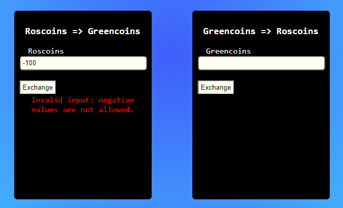

Таким образом, мы успешно устранили уязвимости на сервисе **atom-shop**! (Или нет?)

---
## [0x04] Service 3: atom-study

Университет ГК «Росатом» — это ведущий образовательный и научно-исследовательский центр в области атомной энергетики и смежных дисциплин. Он был основан в 2010 году и расположен в городе М***. Университет предлагает широкий спектр образовательных программ, включая бакалавриат, магистратуру, аспирантуру и дополнительное профессиональное образование. В университете работает высококвалифицированный преподавательский состав, состоящий из учёных, инженеров и практиков из различных отраслей атомной энергетики. Университет сотрудничает с ведущими российскими и международными компаниями, а также с научными организациями. Университет ГК «Росатом» активно занимается научными исследованиями и разработками в области атомной энергетики, ядерной физики, материаловедения и других смежных дисциплин. Результаты этих исследований публикуются в ведущих научных журналах и докладываются на международных конференциях. Университет также уделяет большое внимание практической подготовке студентов и специалистов. Для этого в университете созданы современные лаборатории, оснащённые новейшим оборудованием, а также центры сертификации и аттестации персонала. Университет ГК «Росатом» является важным элементом российской системы образования и науки в области атомной энергетики. Он вносит значительный вклад в развитие этой отрасли, подготовку квалифицированных кадров и укрепление международного сотрудничества в данной сфере.

### Vuln 1 - SQL Injection

Первая уязвимость в **atom-study** заключается в **Error-Based SQL Injection** и имеет множество вариантов эксплуатации. Проблема заключается во внесении данных от пользователя напрямую, без фильтрации. При этом методы эксплуатации являются в некотором роде специфичными. И на это своя причина, потому что в MySQL, где расположены основные таблицы БД сервиса, есть своя особенность в использовании оператора **INSERT**.

> Есть обсуждение на эту тему - https://stackoverflow.com/questions/4593563/sql-injection-on-insert

В папке **write-ups/materials** можно изучить вопрос еще более детально.

Если говорить кратко, то драйвер MySQL не допускает выполнения нескольких запросов в рамках одного вызова запроса (**query()**), именно поэтому мы не можем использовать, например, **UNION**. Вот несколько вариантов эксплуатации уязвимости:

Получение версии БД:
```
' OR updatexml(1,concat(0x7e,(version())),0) OR '
```

Получение имени БД:
```
' OR updatexml(1,concat(0x7e,(database())),0) OR '
```

Получение данных из таблицы **users** БД **study**:
```
' OR updatexml(0,concat(0x7e,(SELECT concat_ws(':',id,username,password) FROM users limit 0,1)),0) OR '
```

Уязвимое место в нашем случае следующее:

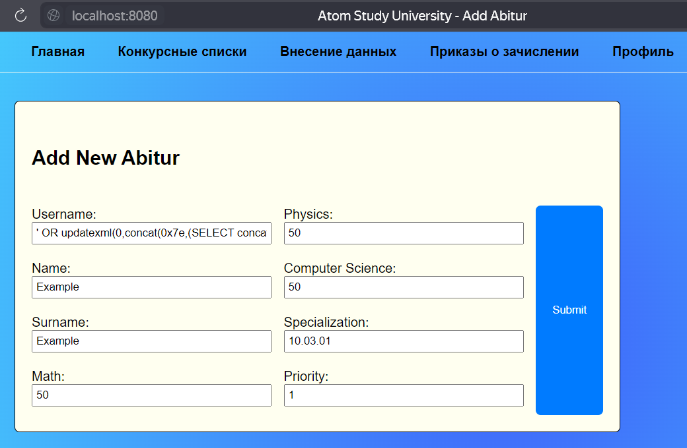

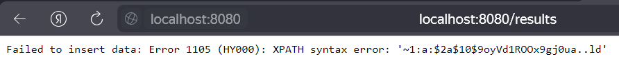

Полезную нагрузку можно ввести в любое поле этой формы

### Patch for Vuln 1

Чтобы защититься от SQL-инъекций в форме ввода данных, необходимо изменить исходный код таким образом, чтобы он производил фильтрацию пользовательских данных. Рассмотрим исходный код для рассматриваемой формы. Нас интересует функция **Results()** в файле **results.handler.go**:

```go
query := fmt.Sprintf(
    "INSERT INTO abiturs (username, name, surname, math, physics, compsci, spec, priority) VALUES ('%s', '%s', '%s', '%s', '%s', '%s', '%s', '%s')",
    form.Username, form.Name, form.Surname, form.Math, form.Physics, form.Compsci, form.Spec, form.Priority,
)

if err := database.DB.Exec(query).Error; err != nil {
    return c.Status(fiber.StatusInternalServerError).SendString(fmt.Sprintf("Failed to insert data: %v", err))
}
```

Основная проблема - прямая вставка данных пользовательского ввода. Изменить код мы можем соответствующим образом:

```go
query := "INSERT INTO abiturs (username, name, surname, math, physics, compsci, spec, priority) VALUES (?, ?, ?, ?, ?, ?, ?, ?)"

if err := database.DB.Exec(query, form.Username, form.Name, form.Surname, form.Math, form.Physics, form.Compsci, form.Spec, form.Priority).Error; err != nil {
    return c.Status(fiber.StatusInternalServerError).SendString(fmt.Sprintf("Failed to insert data: %v", err))
}
```

Патч в данном случае заключается в измененном состоянии пользовательского ввода - при использовании **fmt.Sprintf** данные пользователя вставляются в SQL-выражение на места **?** не как часть запроса SQL, а как текст.

Проверим наш патч:

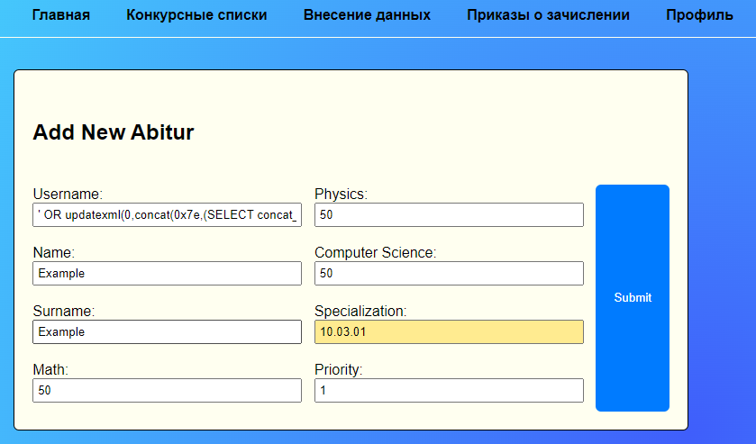

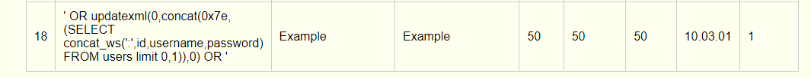

Как видим, наш запрос действительно вставился в таблицу БД как текст, а не часть SQL-запроса

---

### Vuln 2 - SQL Injection

Вторая уязвимость также связана с внедрением SQL-кода, но уже в другой форме - в форме поиска данных об абитуриентах. Суть заключается в том, что мы можем прочитать данные из другой таблицы, например, из таблицы **users**, тогда как в стандартном функционале поиск происходит по таблице **abiturs**. Сделать это можно через использование вредоносного запроса на основе **UNION**:

```
' UNION SELECT 1, username, password, 1, 1, 1, 1, 1, 1 FROM users #
```

В данном случае неоходимо немного пояснений. Возможно вы заметили, что в **UNION** мы используем символы **1**. Это необходимо для того, чтобы уровнять количество колонок БД, т.к. это необходимо для оператора **UNION**. Рассмотрим более детально таблицы БД:

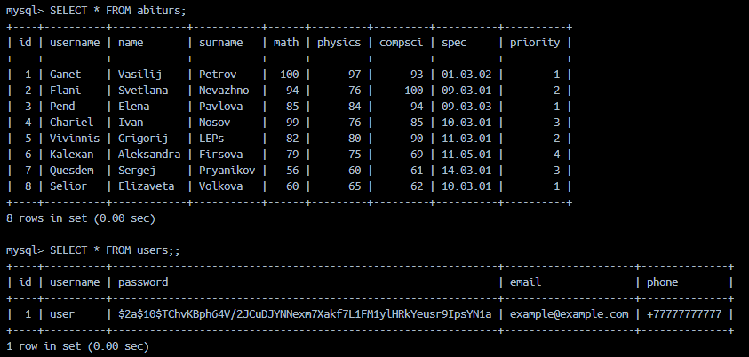

Как видим, в таблице **abiturs** есть 9 столбцов, а в таблице **users** всего 5. Теперь снова обратим внимание на вредоносный **UNION-based** запрос:

```
' UNION SELECT 1, username, password, 1, 1, 1, 1, 1, 1 FROM users #
```

Мы хотим из таблицы **users** получить всего 2 столбца - **username** и **password**, а так как в таблице **abiturs** у нас 9 столбцов, соответственно, нам надо "вызвать" еще 7 дополнительных столбцов, чтобы количество последних совпадало. Вместо **1** можно использовать, например, **null**.

Перейдем к эксплуатации. Если мы введем какое-нибудь **существующее** имя из списка абитуриентов, то нам выведется соответствующий результат поиска:

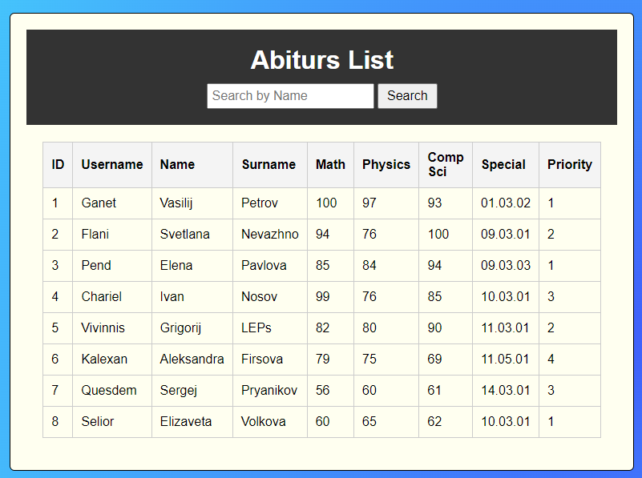

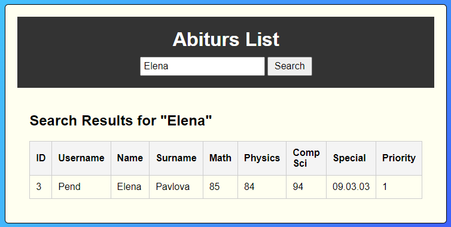

Но если мы введем полезную нагрузку в виде SQL-запроса, то:

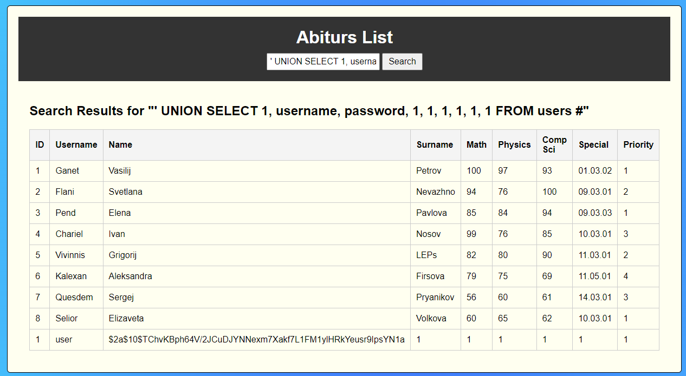

Мы увидим, что в таблице появилась запись о пользователе **user** из таблицы **users** вместе с захэшированным паролем.

### Patch for Vuln 2

Найдем уязвимую часть кода, которая отвечает за обработку поиска (функция **Lists()** в **lists.handler.go**):

```go
if name != "" {
    query := "SELECT * FROM abiturs WHERE name LIKE '%" + name + "%'"
    database.DB.Raw(query).Scan(&abiturs)
} else {
    database.DB.Find(&abiturs)
}

return c.Render("views/lists", fiber.Map{
    "Abiturs": abiturs,
    "Name":    name,
})
```

Чтобы исправить наш код, необходимо снова сделать передачу пользовательского ввода в безопасном варианте с использованием **?**. Исправленный вариант кода:

```go
name := c.Query("name")

if name != "" {
    query := "SELECT * FROM abiturs WHERE name LIKE ?"
    likePattern := "%" + name + "%"
    database.DB.Raw(query, likePattern).Scan(&abiturs)
} else {
    database.DB.Find(&abiturs)
}

return c.Render("views/lists", fiber.Map{
    "Abiturs": abiturs,
    "Name":    name,
})
```

Проверка:

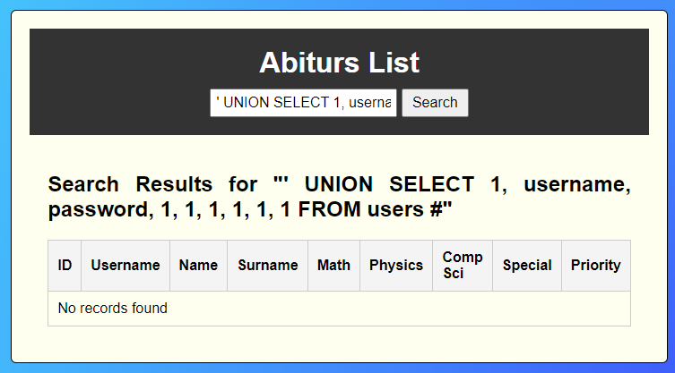

Как видим, нам успешно удалось избавиться от второй уязвимости в коде!

---

### Vuln 3 - Path Traversal

Заключительная уязвимость для сервиса **atom-study** представляет собой **Path Traversal**, что позволяет читать системные файлы внутри docker-контейнера. Для ее обнаружения достаточно перейти на страницу **/documents** и посмотреть, каким образом открываются файлы с конкурсными списками:

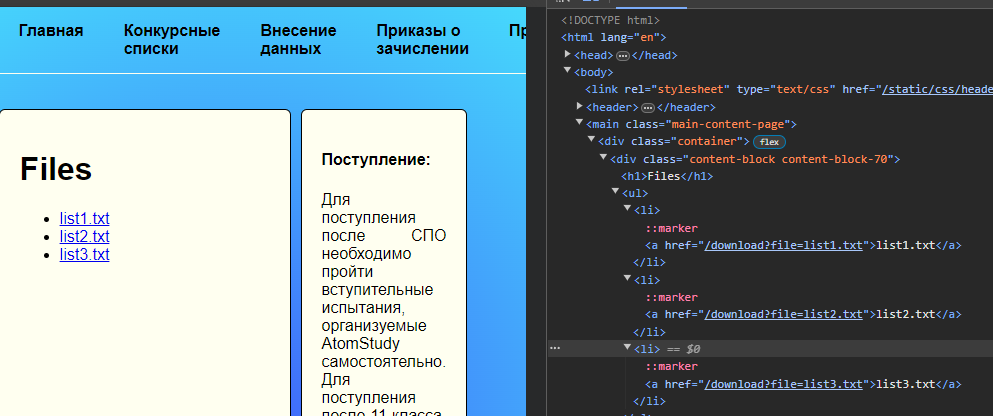

```
/download?file=<filename>
```

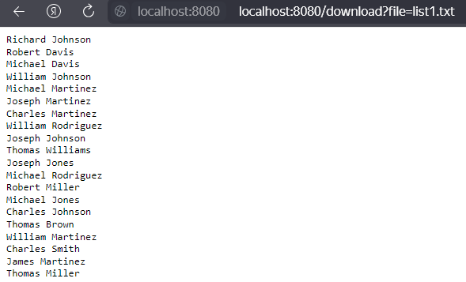

Это и есть уязвимое место. Для того, чтобы открыть файл **/etc/passwd**, необходимо использовать следующий запрос:

```
/download?file=../../etc/passwd
```

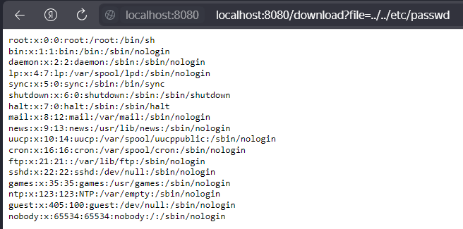

### Patch for Vuln 3

Исправляем найденную уязвимость. Уязвимая часть кода находится в функции **GetFile()** в файле **documents.handler.go**:

```go
filename := c.Query("file")
	
if filename == "" {
	return c.Status(fiber.StatusBadRequest).SendString("Filename is required")
}

filePath := filepath.Join("./files", filename)

return c.SendFile(filePath)
```

Нам необходимо ввести проверку на то, что запрашиваемый файл находится в рамках директории **./files**:

```go
filename := c.Query("file")

if filename == "" {
    return c.Status(fiber.StatusBadRequest).SendString("Filename is required")
}

// Очистка пути и создание абсолютного пути к файлу
filePath := filepath.Join("./files", filepath.Clean(filename))

// Проверка, что файл находится в пределах допустимой директории
absPath, err := filepath.Abs(filePath)
if err != nil {
    return c.Status(fiber.StatusInternalServerError).SendString("Failed to resolve file path")
}

// Убедимся, что запрашиваемый файл находится внутри директории ./files
if !strings.HasPrefix(absPath, filepath.Clean("./files")) {
    return c.Status(fiber.StatusForbidden).SendString("Access to the file is forbidden")
}

return c.SendFile(absPath)
```

> Не забываем обновить в рассматриваемом файле блок import, добавив "strings"

```go
import (
	"github.com/gofiber/fiber/v2"
	"io/ioutil"
	"net/http"
	"path/filepath"
	"strings"   // Added
)
```

Проверяем:

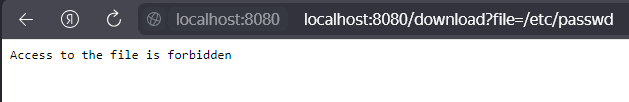

И да, мы устранили заключительную уязвимость на сервисе!

---
## [0x05] P.S.

Made with <3 by o1d_bu7_go1d

---
